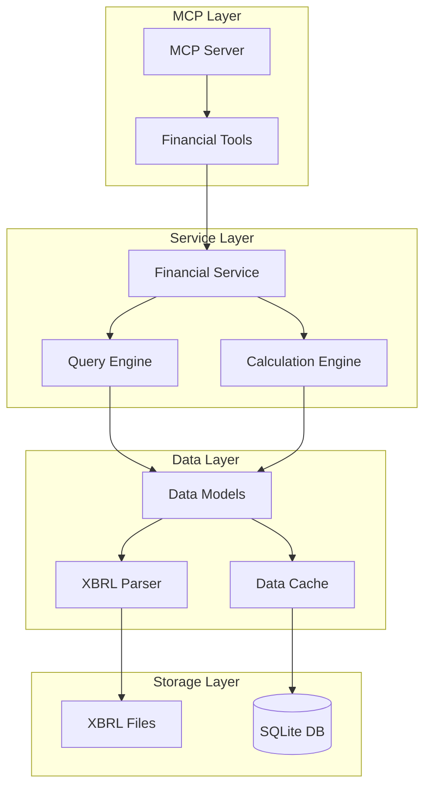

# Design Document

## Overview

The XBRL Financial Data Service is a Python-based system that parses XBRL financial documents and provides structured financial data through a Model Context Protocol (MCP) interface. The system consists of multiple layers: XBRL parsing, data processing, caching, and MCP service exposure.

## Architecture



## Components and Interfaces

### 1. XBRL Parser Module (`xbrl_parser.py`)

**Purpose:** Parse XBRL files and extract structured financial data

**Key Classes:**
- `XBRLParser`: Main parser class
- `TaxonomyParser`: Handles schema and linkbase parsing
- `InstanceParser`: Handles instance document parsing
- `FactExtractor`: Extracts financial facts with contexts

**Interfaces:**
```python
class XBRLParser:
    def parse_filing(self, file_paths: Dict[str, str]) -> FilingData
    def parse_schema(self, schema_path: str) -> TaxonomySchema
    def parse_linkbase(self, linkbase_path: str, linkbase_type: str) -> Linkbase
    def parse_instance(self, instance_path: str) -> InstanceDocument
```

### 2. Data Models (`models.py`)

**Purpose:** Define structured data representations for financial information

**Key Classes:**
- `FilingData`: Complete filing information
- `FinancialStatement`: Individual statement data
- `FinancialFact`: Individual data point with context
- `TaxonomyElement`: XBRL element definition
- `CalculationRelationship`: Calculation linkage between elements

**Interfaces:**
```python
@dataclass
class FinancialFact:
    concept: str
    value: Union[float, str, int]
    unit: Optional[str]
    period: str
    context_id: str
    decimals: Optional[int]
    
@dataclass
class FinancialStatement:
    statement_type: str
    facts: List[FinancialFact]
    calculations: List[CalculationRelationship]
    presentation_order: List[str]
```

### 3. Financial Service (`financial_service.py`)

**Purpose:** High-level interface for financial data operations

**Key Classes:**
- `FinancialService`: Main service orchestrator
- `StatementBuilder`: Constructs financial statements
- `MetricsCalculator`: Computes financial ratios and metrics

**Interfaces:**
```python
class FinancialService:
    def get_income_statement(self, period: str = None) -> IncomeStatement
    def get_balance_sheet(self, period: str = None) -> BalanceSheet
    def get_cash_flow_statement(self, period: str = None) -> CashFlowStatement
    def get_financial_ratios(self) -> Dict[str, float]
    def search_facts(self, query: str) -> List[FinancialFact]
```

### 4. Query Engine (`query_engine.py`)

**Purpose:** Handle complex queries and data filtering

**Key Classes:**
- `QueryEngine`: Main query processor
- `FilterBuilder`: Constructs data filters
- `AggregationEngine`: Handles data aggregation

**Interfaces:**
```python
class QueryEngine:
    def execute_query(self, query: FinancialQuery) -> QueryResult
    def filter_facts(self, filters: Dict[str, Any]) -> List[FinancialFact]
    def aggregate_data(self, facts: List[FinancialFact], method: str) -> Dict[str, Any]
```

### 5. Financial Analysis Engine (`analysis/`)

**Purpose:** Advanced financial analysis with funnel and trend capabilities

**Key Classes:**
- `FunnelAnalyzer`: Creates vertical efficiency funnels (revenue → cash flow → profit → equity → returns)
- `TrendAnalyzer`: Performs horizontal growth analysis across multiple periods
- `DrillDownEngine`: Provides detailed breakdowns by segments, products, or categories
- `EfficiencyCalculator`: Computes conversion rates and margin analysis

**Interfaces:**
```python
class FunnelAnalyzer:
    def create_efficiency_funnel(self, period: str) -> FinancialFunnel
    def calculate_conversion_rates(self, funnel_data: Dict) -> Dict[str, float]
    def get_drill_down_data(self, level: str, segment: str) -> Dict[str, Any]

class TrendAnalyzer:
    def analyze_growth_trends(self, metrics: List[str], periods: List[str]) -> GrowthAnalysis
    def calculate_cagr(self, values: List[float], periods: int) -> float
    def identify_trend_patterns(self, data: List[float]) -> TrendPattern
```

### 6. MCP Server (`mcp_server.py`)

**Purpose:** Expose financial data through MCP protocol

**Key Classes:**
- `FinancialMCPServer`: MCP server implementation
- `FinancialTools`: MCP tool definitions

**MCP Tools:**
- `get_income_statement`: Retrieve income statement data
- `get_balance_sheet`: Retrieve balance sheet data
- `get_cash_flow`: Retrieve cash flow statement data
- `calculate_ratios`: Calculate financial ratios
- `analyze_financial_funnel`: Create vertical efficiency funnel analysis
- `analyze_growth_trends`: Perform horizontal trend analysis
- `get_drill_down_analysis`: Get detailed segment breakdowns
- `search_financial_data`: Search for specific financial information
- `get_company_info`: Get basic company information

## Data Models

### Core Data Structures

```python
# Financial Statement Types
class StatementType(Enum):
    INCOME_STATEMENT = "income_statement"
    BALANCE_SHEET = "balance_sheet"
    CASH_FLOW = "cash_flow_statement"
    SHAREHOLDERS_EQUITY = "shareholders_equity"
    COMPREHENSIVE_INCOME = "comprehensive_income"

# Financial Fact with full context
@dataclass
class FinancialFact:
    concept: str                    # XBRL concept name
    label: str                     # Human-readable label
    value: Union[float, str, int]  # Actual value
    unit: Optional[str]            # Currency or unit
    period: str                    # Time period
    period_type: str              # instant, duration
    context_id: str               # XBRL context reference
    decimals: Optional[int]       # Decimal precision
    dimensions: Dict[str, str]    # Additional dimensions
    
# Calculation relationship
@dataclass
class CalculationRelationship:
    parent: str                   # Parent concept
    child: str                   # Child concept
    weight: float                # Calculation weight
    order: int                   # Presentation order
```

### Advanced Data Models for Funnel Analysis

```python
# Financial Funnel Models
@dataclass
class FunnelLevel:
    level_name: str                    # e.g., "Revenue", "Gross Profit", "Operating Income"
    value: float                       # Actual financial value
    conversion_rate: Optional[float]   # Conversion from previous level
    margin_rate: Optional[float]       # Percentage of total revenue
    children: List['FunnelLevel']      # Sub-levels for drill-down
    period: str                        # Time period
    
@dataclass
class FinancialFunnel:
    company_name: str
    period: str
    revenue_funnel: FunnelLevel        # Revenue → Gross Profit → Operating Income
    cash_flow_funnel: FunnelLevel      # Operating CF → Free CF → Shareholder Returns
    profitability_funnel: FunnelLevel  # Operating Income → Net Income → ROE
    capital_efficiency: Dict[str, float] # ROA, ROE, Asset Turnover, etc.

@dataclass
class GrowthMetric:
    metric_name: str
    periods: List[str]
    values: List[float]
    growth_rates: List[float]          # Period-over-period growth
    cagr: Optional[float]              # Compound Annual Growth Rate
    trend_direction: str               # "increasing", "decreasing", "stable"

@dataclass
class DrillDownData:
    level_name: str
    breakdown_type: str                # "product", "geography", "segment"
    items: Dict[str, float]            # Item name -> value
    percentages: Dict[str, float]      # Item name -> percentage of total
```

### Database Schema

```sql
-- Core tables for caching parsed data
CREATE TABLE filings (
    id INTEGER PRIMARY KEY,
    company_name TEXT,
    cik TEXT,
    filing_date DATE,
    period_end_date DATE,
    form_type TEXT,
    created_at TIMESTAMP DEFAULT CURRENT_TIMESTAMP
);

CREATE TABLE facts (
    id INTEGER PRIMARY KEY,
    filing_id INTEGER,
    concept TEXT,
    label TEXT,
    value TEXT,
    unit TEXT,
    period TEXT,
    period_type TEXT,
    context_id TEXT,
    decimals INTEGER,
    FOREIGN KEY (filing_id) REFERENCES filings(id)
);

CREATE TABLE calculations (
    id INTEGER PRIMARY KEY,
    filing_id INTEGER,
    parent_concept TEXT,
    child_concept TEXT,
    weight REAL,
    order_num INTEGER,
    FOREIGN KEY (filing_id) REFERENCES filings(id)
);

-- Advanced analysis tables
CREATE TABLE funnel_analysis (
    id INTEGER PRIMARY KEY,
    filing_id INTEGER,
    funnel_type TEXT,              -- 'revenue', 'cash_flow', 'profitability'
    level_name TEXT,
    value REAL,
    conversion_rate REAL,
    margin_rate REAL,
    parent_level TEXT,
    created_at TIMESTAMP DEFAULT CURRENT_TIMESTAMP,
    FOREIGN KEY (filing_id) REFERENCES filings(id)
);

CREATE TABLE growth_analysis (
    id INTEGER PRIMARY KEY,
    filing_id INTEGER,
    metric_name TEXT,
    period_start TEXT,
    period_end TEXT,
    growth_rate REAL,
    cagr REAL,
    trend_direction TEXT,
    created_at TIMESTAMP DEFAULT CURRENT_TIMESTAMP,
    FOREIGN KEY (filing_id) REFERENCES filings(id)
);
```

## Error Handling

### Error Types and Handling Strategy

1. **Parsing Errors**
   - Invalid XBRL structure
   - Missing required files
   - Schema validation failures
   - Strategy: Log errors, provide partial data where possible

2. **Data Quality Issues**
   - Calculation inconsistencies
   - Missing required facts
   - Invalid data types
   - Strategy: Flag issues, provide warnings in responses

3. **Query Errors**
   - Invalid query parameters
   - Data not found
   - Timeout errors
   - Strategy: Return structured error responses with suggestions

4. **MCP Protocol Errors**
   - Invalid tool calls
   - Connection issues
   - Serialization errors
   - Strategy: Follow MCP error response format

### Error Response Format

```python
@dataclass
class ErrorResponse:
    error_type: str
    message: str
    details: Optional[Dict[str, Any]]
    suggestions: Optional[List[str]]
    
# Example error responses
PARSING_ERROR = ErrorResponse(
    error_type="parsing_error",
    message="Failed to parse XBRL schema file",
    details={"file": "aapl-20240928.xsd", "line": 123},
    suggestions=["Check file format", "Validate XML structure"]
)
```

## Testing Strategy

### Unit Testing
- Test each parser component independently
- Mock XBRL file inputs for consistent testing
- Validate data model serialization/deserialization
- Test calculation engine accuracy

### Integration Testing
- Test complete XBRL file processing pipeline
- Validate MCP server tool responses
- Test concurrent request handling
- Verify database operations

### Performance Testing
- Benchmark parsing performance with large files
- Test memory usage under load
- Validate response times for cached vs. uncached data
- Test concurrent user scenarios

### Data Quality Testing
- Validate calculation relationships
- Test data consistency across statements
- Verify period and context handling
- Test edge cases and error conditions

## Security Considerations

1. **Input Validation**
   - Sanitize all file inputs
   - Validate XBRL structure before processing
   - Limit file sizes and processing time

2. **Data Access Control**
   - Implement rate limiting for MCP requests
   - Log all data access for audit trails
   - Validate query parameters to prevent injection

3. **Error Information Disclosure**
   - Avoid exposing internal system details in errors
   - Sanitize error messages for external consumption
   - Log detailed errors internally only

## Performance Optimization

### Caching Strategy
- Cache parsed XBRL data in SQLite database
- Implement in-memory caching for frequently accessed data
- Use Redis for distributed caching if needed

### Parsing Optimization
- Stream processing for large XML files
- Parallel processing of multiple linkbase files
- Lazy loading of detailed fact data

### Query Optimization
- Index database tables for common query patterns
- Pre-compute common financial ratios
- Implement query result caching

## Deployment and Configuration

### Configuration Management
```python
# config.py
@dataclass
class Config:
    database_path: str = "financial_data.db"
    cache_ttl: int = 3600  # 1 hour
    max_file_size: int = 100 * 1024 * 1024  # 100MB
    mcp_port: int = 8000
    log_level: str = "INFO"
    supported_taxonomies: List[str] = field(default_factory=lambda: ["us-gaap"])
```

### Environment Setup
- Python 3.9+ required
- Dependencies: lxml, sqlite3, asyncio, mcp-python
- Docker containerization support
- Environment-specific configuration files

This design provides a robust, scalable foundation for the XBRL financial data service with clear separation of concerns and comprehensive error handling.